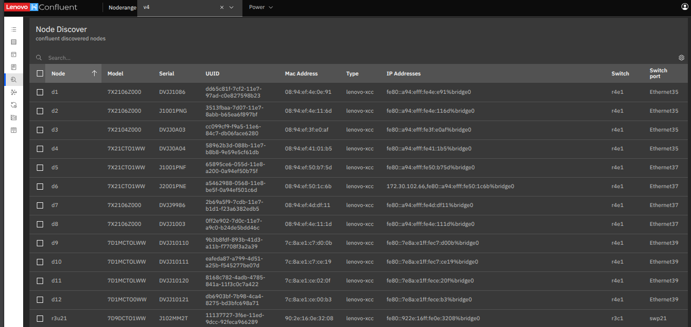
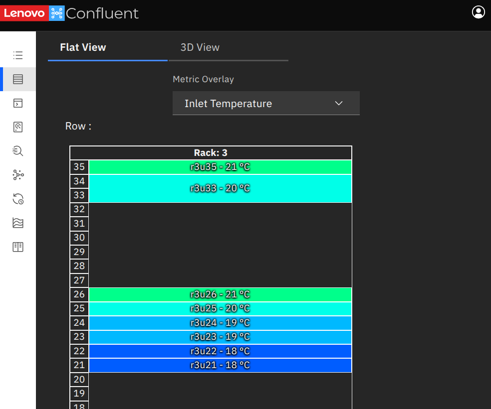
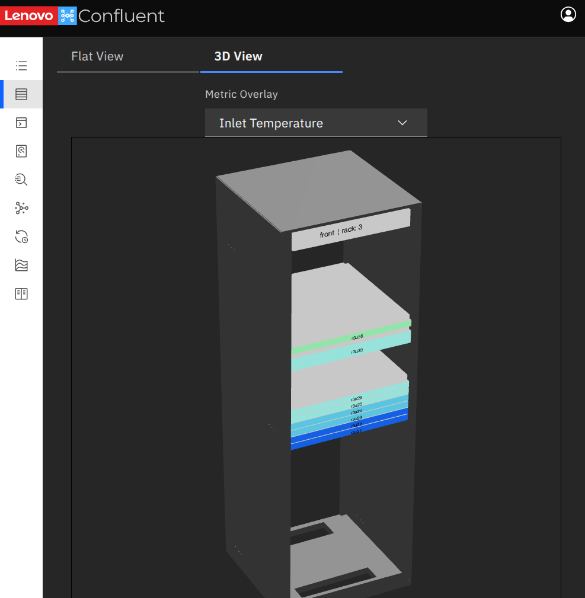

# 3.12.0 Confluent release

3.12.0 has been released with the following changes:
<!-- more -->

# Support for discovery of Lenovo V4 systems with XCC3

The new generation of Lenovo servers are supported, recommended hardwaremanagement.method value of 'redfish' and
console.method value of 'openbmc'.

# `nodeidentify` now implements `blink` for Lenovo systems with IPMI

OEM extensions are used to add the ability despite not being in the standard.

# Fix host based authentication with SUSE diskless
 
Non-root users may now do node to node ssh in SUSE diskless deployments

# Fix noderename attribute inheritance

Executing `noderename` was failing to produce the correct attribute values based on node name, this
has been corrected.

# Add nVent PDU support

Basic PDU functionality for nVent PDUs has been implemented

# Deployment of CentOS Stream 10 and Alma Linux Kitten 10

Support has been added for Stream 10/Kitten 10 as a deployment target.

# Ability to deploy EL9 "diskless" profiles to disk

If the profile adds `installtodisk` to the kernel arguments, it will now install the image to disk, rather
than booting it from network.

# Fix NVMe install support for some configurations

Some NVMe configurations do not manifest a driver, now the 'nvm' subsystem is used as a criteria if no
driver detected.

# Implement infiniband bond in confignet

Using IB interfaces in a bond is now properly implemented

# Improve ssh to localhost

localhost has been added as a principal and shosts/hosts.equiv to facilitate the common use case.  This should not pose any additional risk, given the nature of localhost.

# Do not clear an already off node in `nodeconsole`

Some systems misreport their power state. This caused nodeconsole to insistently clear the screen with a reminder
the target system is off.  It will now avoid doing so, and only clear it when it's newly "off".  This allows
the user to interact with the console, though the initial message will still indicate that the system is off
and buffer replay will not happen as a result.

# Extend discovery to cover multi-nic XCCs

If an XCC has two NICs and is using the second interface during discovery, this is now handled.

# Compatibility with EL9.5

EL 9.5 introduced some incompatibilities.  Confluent 3.12 has workarounds for dealing with the changes
in name resolution associated with the 9.5 update.

# Improved network setup in Ubuntu with identity image

The network configuration step is repeated until success, rather than only making a single attempt.

# New Web GUI

## The web GUI now honors system light/dark theme preference

When you select a light or dark theme for your desktop, the new confluent GUI will attempt
to accomodate that preference.

## Import OS images through a browser

The `browserfs` service is now available to facilitate live import through the browser without
requiring a full upload up front.

## Initiate deployment from the browser

Deploying an OS to nodes can now be done from the browser.

## Browser based node discovery

## Support for remote video for select systems

Support for OpenBMC based remote video has been added, including the V4 Lenovo systems using XCC3.

## Ability to perform firmware updates added

The Web GUI can now execute firmware updates.

## Passkey support has been added, where available

For management systems running EL9, passkey support has been added.

## New rack views

The traditional rack view has been re-implemented for more flexibility, and a 3D rack view has been implemented.

